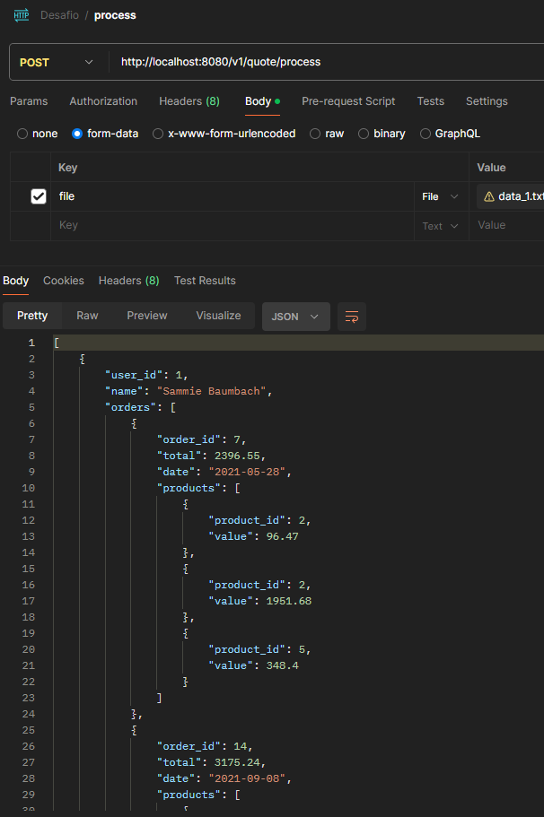
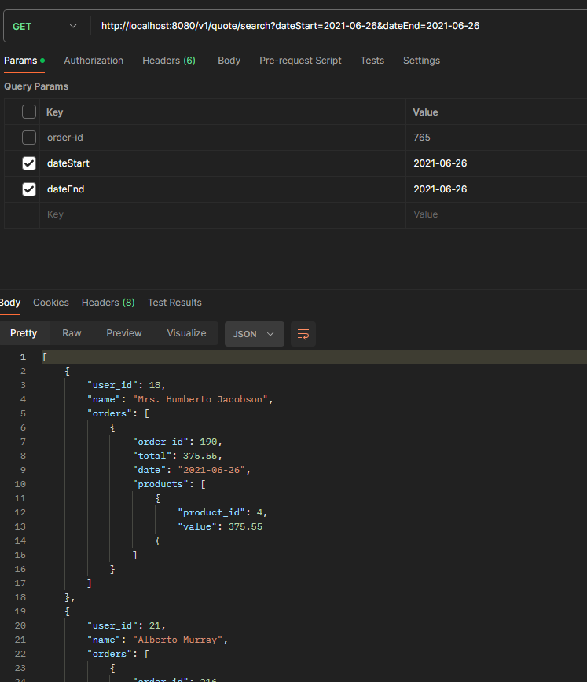
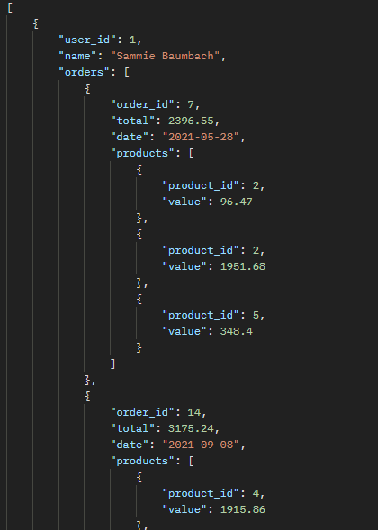
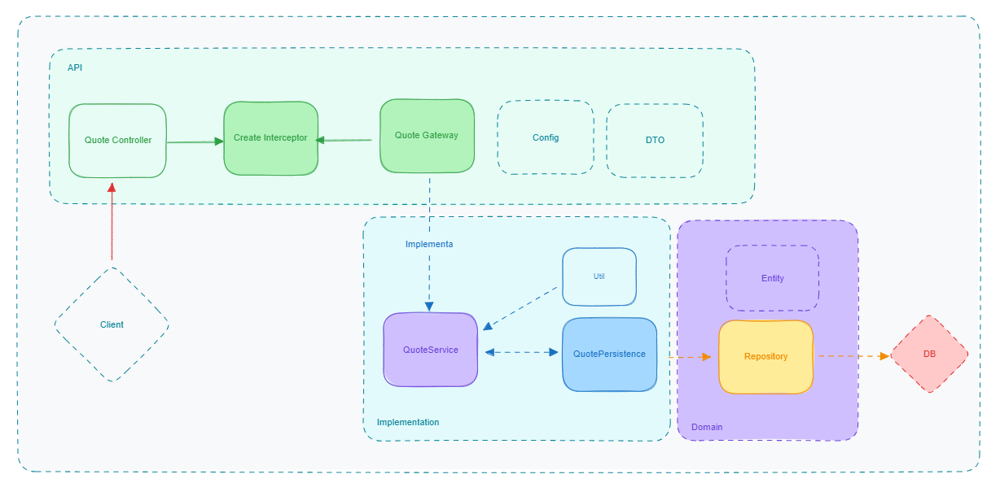
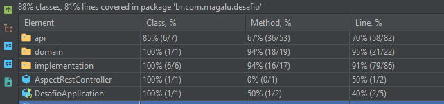
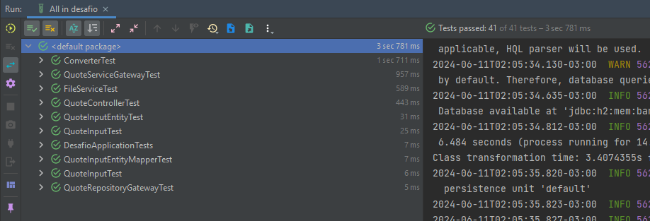

 ## Desafio Magalu ##

###Iniciando
Git Clone: [https://github.com/pedrohenriqueveiga/desafio](https://github.com/pedrohenriqueveiga/desafio)

`cd desafio-magalu`

###Pré-Requisitos:

`mvn --version`

você deverá ver a indicação da versão do Maven instalada e a versão do JDK, dentre outras. Observe que o JDK é obrigatório, assim como a definição das variáveis de ambiente JAVA_HOME e M2_HOME.

### Limpar, compilar, executar testes de unidade e cobertura
* ` mvn clean`

remove diretório target

* `mvn compile`

compila o projeto, deposita resultados no diretório target

* `mvn test`

Executa todos os testes do projeto. Para executar apenas parte dos testes, por exemplo, 
aqueles contidos em uma dada classe execute `mvn -Dtest=NomeDaClasseTest test`.
Observe que o sufixo do nome da classe de teste é Test (padrão recomendado).


### Sobre a estrutura de projeto

#### Packages 
    
* API 
    * Config - Classe de configuração para levantar os beans necessários.
    * dto - Package destinado a todos os records de "Data Transfer Objects".
    * gateways -  Interface de abstração para inverter dependências.
    * resource - Package destinado aos constrollers REST.
    * usecases - Classe Interector para abstração e inversão de dependências. 
* Domain 
  * Entity - Package destinado a armazenar as classes Entidades do Banco.
  * Repository - Package destinado a armazenar interfaces com conexão do JPA.
* Implementation
  * persistence - Package para Armazenar todas as classes e métodos que consomem o Repository.
  * service - Package de serviços para Lógica.
  * util - Package destinado a funções para reeutilizar, enums, etc.
 
* Infra
  * Exceptions - Package destinado a curadoria de todas as exceções customizadas dentro da Aplicação.

_AspectRest_ -  Controller para interceptar cada controller antes da execução, justamente para validar logs e avaliar consumo em tempo real.
___

### Técnicas e Tecnologias Utilizadas

* Java 17
* IntellJ IDEA
* Paradigmas de Orientação a Objeto


___
### Requests

`POST http://localhost:8080/v1/quote/proccess`, 

adicionando o arquivo data_1.txt ou data_2.txt no MultipartFile.

___
`GET http://localhost:8080/v1/quote/search`,

filtros como parametro da reques:
* order-id (identificador do Pedido)
* dateStart (2021-05-25) 
* dateEnd   (2021-06-27) 

___
### Input de Dados
Avaliando o input de dados (data_1.txt e data_2.txt),
ele segue um padrão de quantidade de caracteres fixos, logo o tratamento de dados que utilize
foi um Pattern para extrair campo a campo com base no tamanho de cada atributo.
Então a Lógica  mais simples de extração que encontrei foi criar um Pattern e especificar os caracteres de cada sessão.
```
|-userId--|--------------userName----------------------|-orderId-|-prodId--|---value---|-date--|
0000000070                              Palmer Prosacco00000007530000000003     1836.7420210308
0000000075                                  Bobbie Batz00000007980000000002     1578.5720211116
0000000049                               Ken Wintheiser00000005230000000003      586.7420210903
0000000014                                 Clelia Hills00000001460000000001      673.4920211125
0000000057                          Elidia Gulgowski IV00000006200000000000     1417.2520210919 
````
 * (Solução) 
`Pattern pattern = Pattern.compile("(.{10})(.{45})(.{10})(.{10})(.{12})(.{8})");`
___
 ### Zeros a Esquerda
 * Após a aplicação do Pattern, tanto os atributos `userId`, `orderId` e `prodId`, veem com uma sequência de zeros a esquerda.
   * (Solução)Aproveitei para criar um regex `"^0+(?!$)"`, onde todos os zeros a esquerda serão removidos, assim limpando os dados desnecessários.
___
 ### Output
 * Foi especificado um payload via documento, onde segue um Json Property Order.
 * Após as estração de dados via Pattern, criei um objeto do tipo `QuoteEntity`, que foi utilizado para Armazenar tanto no banco de dados em memória(h2), quanto para utilizar no processo de manipulção e agrupamento.
 * O Mappeamento foi utilizado um HashMap `static method (groupByOrderId)`, onde ele instância uma Map e percorre a lista de QuoteInput,
 Construido o mapeamento, onde a chave(K) é o "user_id" e assim agrupamos as duplicidades.
Dentro do Objeto "QuoteOutput" existe um método void addQuote, onde ele vai filtrar e inserir se necessário, caso o OrderId seja igual, subsequentemente também adiciona os produtos ao seu "Quote".
 * Após percorrer a lista e mapeando em hashMap, devolvo o Map pegando seus valores e convertendo em ArrayList para a Tipagem "QuoteOutput".
 * Também existe um Comparator para colocar os "Orders" em Ordem de Identificador (Ascending Order).


### Output:
 
### Desenho da API


### Coverage


### Testes



